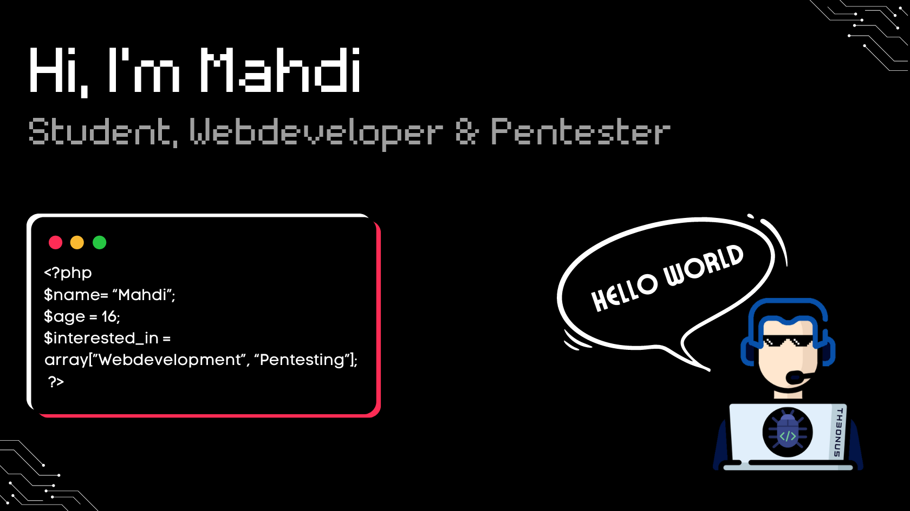

## 💫 What I’m Working On
- 🔍 Expanding my knowledge in **Penetration Testing**
- 💻 **Learning Python** to enhance my automation and scripting skills
- 🚀 Exploring **open-source security tools** and contributing to projects

## 🛠️ Technologies & Tools

### Web Security Testing

### Network Security

### Exploitation Frameworks

### Languages

### Web Development

### Operating Systems & Platforms

## 📊 GitHub Stats

## 🌐 Connect With Me
)

## 🐍 Contribution Graph

## 💭 Quote
> "Ich hacke nicht – ich entdecke nur, wie sicher das System wirklich ist!"

